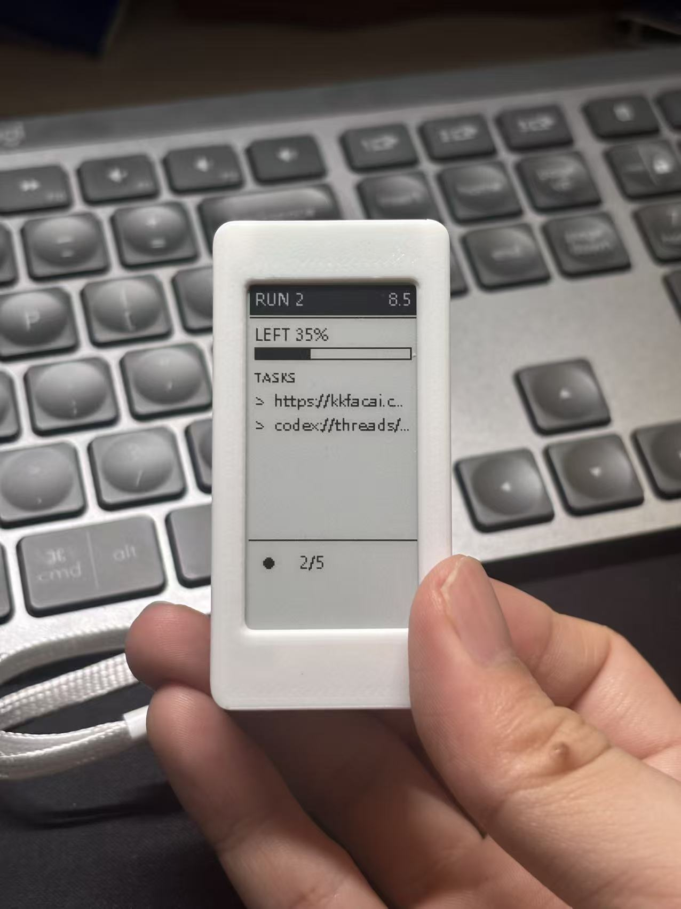

# Codex 无线墨水屏额度监控

[中文](README.md) | **English**



> A low-cost Bluetooth e-ink display that **wirelessly** shows Codex quota and task status.

## What this is

This small Windows tool puts Codex Desktop's task and quota information on a desk e-ink display. The computer reads the state and sends a monochrome frame to the display over Bluetooth. There is no data cable, firmware flashing, or separate ESP board involved.

An e-ink panel is not a phone screen: the program triggers an update quickly, but the panel usually needs a few more seconds to complete its physical refresh. Task status is therefore not guaranteed to appear instantly; the actual delay depends on the full refresh waveform, Bluetooth transfer, and device state.

It is meant for anyone who wants a simple, inexpensive desk display for Codex instead of keeping the Codex window open all the time.

## What you can see

- the existing Codex sidebar title, running state, and plan progress;
- completion, failure, and unread alerts;
- the primary quota percentage and reset date;
- up to 8 bottom status slots, arranged as 4 on the top row and 4 on the bottom row;
- quick refresh triggers after task changes and automatic quota updates; the visible screen may still lag by a few seconds.

Based on the author's purchase experience, similar devices on Pinduoduo can cost about RMB 15 after coupons. With the current low-power update strategy, battery life is expected to remain around three months. Price and battery life vary with promotions, battery capacity, refresh frequency, and hardware batch. For this kind of low-cost setup, it may be one of the cheapest Codex quota monitor solutions currently available.

## What's new in 2.0

- **Event-driven refresh**: local Codex state changes are watched and normally processed about one second after they occur; 30-second (active) and 60-second (idle) polling remains as a fallback.
- **Shorter refresh wait**: the maximum trigger wait is reduced by about 29 seconds (about 97%) for active tasks and 59 seconds (about 98%) for idle tasks; the display itself still needs a few seconds for a full physical refresh.
- **More stable task state**: running activity, activity continuation, plan-step progress, completion, failure, and unread reminders are recognized more reliably, reducing task-count oscillation.
- **Lower-power BLE updates**: unchanged content skips scanning, connecting, and uploading, while small voltage fluctuations no longer trigger repeated full-screen updates, so battery life is expected to remain around three months.

Current release: [Codex E-Ink Dashboard 2.0](https://github.com/627150795/codex-eink-dashboard/releases/tag/v2.0.0)

## How to read the screen

| Area | Example | Meaning |
| --- | --- | --- |
| Top left | `RUN 2` | `RUN` = running, `WAIT` = waiting, `DONE` = completed, `ERR` = failed, `LIMIT` = quota exhausted, `OFFLINE` = not recently synced, `IDLE` = idle; the number is the active-task count. |
| Top right | `8.5` / `API` | `8.5` is the weekly quota reset date (`month.day`); `API` means API-account mode. |
| Quota area | `LEFT 35%` + bar | 35% of the primary quota remains. |
| Task area | `TASKS`, `>`, `?` | Existing Codex sidebar titles; `>` means running and `?` means waiting. The program does not invent English task names. |
| Bottom status strip | `●`, `2/5`, `✓`, `×` | Running, plan progress, completed, and failed. Completed/failed states only remain as unread alerts and are cleared automatically after up to two hours. |

## Requirements

- Windows and Codex Desktop;
- an `SKD-CLOCK`-style display that supports BLE image transfer;
- the current implementation is mainly verified with a 212×104 monochrome panel;
- the computer and display communicate wirelessly over Bluetooth.

Other panel sizes or firmware variants may not be compatible. The program checks the reported resolution after connecting and refuses to write when it does not match.

## Quick start

Open PowerShell in the project directory:

```powershell
.\install.ps1
Copy-Item .\config.example.json .\config.json
```

Fill in the Bluetooth address in `config.json`, or leave it empty to scan for an `SKD-CLOCK` device:

```powershell
.\start.ps1 preview --all --output previews  # preview without Bluetooth
.\start.ps1 probe                            # check the device
.\start.ps1 run                              # start the wireless monitor
```

Install automatic startup if needed:

```powershell
.\install-task.ps1
```

## Key features

- **Wireless updates**: the computer sends frames to the display over Bluetooth;
- **Fast state following**: task start, plan changes, completion, failure, and unread changes normally trigger a refresh after about one second; the panel usually needs a few more seconds to finish the physical refresh;
- **Low power**: unchanged frames do not open a Bluetooth connection, while 30/60-second polling remains only as a fallback;
- **Local privacy**: Codex data is read locally; full prompts and replies are not uploaded;
- **No firmware changes**: the display keeps its original firmware and protocol.

## Technical details

Protocol, refresh flow, event watching, quota fallback, and portrait-layout notes are in the [technical reference](docs/TECHNICAL.md).

## Scope

This is not a replacement for Codex, a cloud service, or a general-purpose e-ink SDK. It only wirelessly displays a summary of local Codex state on a desk panel.
